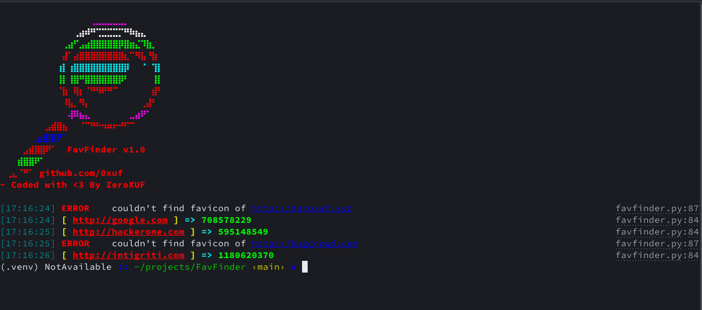

</br>
</br>


<h1 align="center">FavFinder</h1>

<div align="center">
  FavHash is a script that converts url to favhash to use it in search engines. 
</div>
<h2>Screenshot</h2>


## 📋 How to use FavFinder
```bash
git clone git@github.com:0xuf/FavFinder.git
cd FavFinder
python -m pip install -r requirements.txt
```
```bash
cat websites.txt | python favfinder.py -t 10
```

### help text:
```

⠀⠀⠀⠀⠀⠀⠀⠀⠀⠀⠀⠀⠀⠀⠀⠀⢀⣀⣀⣀⣀⣀⡀⠀⠀⠀⠀⠀⠀⠀
⠀⠀⠀⠀⠀⠀⠀⠀⠀⠀⠀⠀⠀⢀⣴⠾⠛⢉⣉⣉⣉⡉⠛⠷⣦⣄⠀⠀⠀⠀
⠀⠀⠀⠀⠀⠀⠀⠀⠀⠀⠀⢀⣴⠋⣠⣴⣿⣿⣿⣿⣿⡿⣿⣶⣌⠹⣷⡀⠀⠀
⠀⠀⠀⠀⠀⠀⠀⠀⠀⠀⠀⣼⠁⣴⣿⣿⣿⣿⣿⣿⣿⣿⣆⠉⠻⣧⠘⣷⠀⠀
⠀⠀⠀⠀⠀⠀⠀⠀⠀⠀⢰⡇⢰⣿⣿⣿⣿⣿⣿⣿⣿⣿⡿⠀⠀⠈⠀⢹⡇⠀
⠀⠀⠀⠀⠀⠀⠀⠀⠀⠀⢸⡇⢸⣿⠛⣿⣿⣿⣿⣿⣿⡿⠃⠀⠀⠀⠀⢸⡇⠀
⠀⠀⠀⠀⠀⠀⠀⠀⠀⠀⠈⣷⠀⢿⡆⠈⠛⠻⠟⠛⠉⠀⠀⠀⠀⠀⠀⣾⠃⠀
⠀⠀⠀⠀⠀⠀⠀⠀⠀⠀⠀⠸⣧⡀⠻⡄⠀⠀⠀⠀⠀⠀⠀⠀⠀⢀⣼⠃⠀⠀
⠀⠀⠀⠀⠀⠀⠀⠀⠀⠀⠀⠀⢼⠿⣦⣄⠀⠀⠀⠀⠀⠀⠀⣀⣴⠟⠁⠀⠀⠀
⠀⠀⠀⠀⠀⠀⠀⠀⣠⣾⣿⣦⠀⠀⠈⠉⠛⠓⠲⠶⠖⠚⠋⠉⠀⠀⠀⠀⠀⠀
⠀⠀⠀⠀⠀⠀⣠⣾⣿⣿⠟⠁⠀⠀⠀⠀⠀⠀⠀⠀⠀⠀⠀⠀⠀⠀⠀⠀⠀⠀
⠀⠀⠀⠀⣠⣾⣿⣿⠟⠁⠀⠀FavFinder v1.0⠀⠀⠀⠀
⠀⠀⠀⣾⣿⣿⠟⠁⠀⠀⠀⠀⠀⠀⠀⠀⠀⠀⠀⠀⠀⠀⠀⠀⠀⠀⠀⠀⠀⠀
⠀⢀⣄⠈⠛⠁⠀github.com/0xuf⠀⠀⠀⠀⠀⠀⠀⠀
- Coded with <3 By ZeroXUF 
	
[17:19:53] Usage:         
    $ echo domain.tld | python favfinder.py  
    $ cat domains.txt | python favfinder.py
(.venv) NotAvailable :: ~/projects/FavFinder ‹main*› » echo websites.txt | python favfinder.py -h
usage: favfinder.py [-h] [--silent] [--threads THREADS]

options:
  -h, --help            show this help message and exit
  --silent, -silent     Show output only without any ascii art
  --threads THREADS, -t THREADS
                        Number of threads 
```


## 🔗 Links
- [My instagram profile](https://www.instagram.com/zeroxuf/)
- [My discord profile](https://discord.com/users/497419128701976587)
- [Medium](https://zeroxuf.medium.com/)
